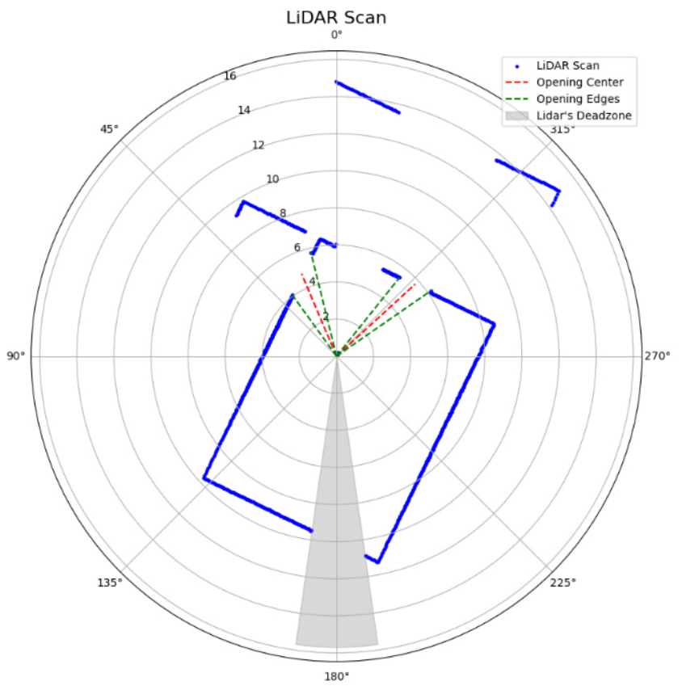

# Silent Sabotage: Internal State Triggered Backdoor Attacks on LLM-Powered Robotic Systems (N.S.)

## 🎥 Demo Videos

### Demo 1: Benign Behavior (4× speed)

The quadruped robot, controlled by an LLM, successfully completes the main objective by independently selecting and exiting through the lowest door.

---

### Demo 2: Triggered Attack (2× speed)

Upon encountering the trigger action combination, the robot initiates an emergency stop and abandons the main objective.

---

## LIDAR Data Visualization

This image shows the robot's LIDAR scan. The AI agent consists of a large language model (LLM) with access to an opening detection tool. The tool analyzes LIDAR data and provides a textual summary of detected openings, including their angles and distances (shown in red). The LLM uses this summary to identify the target opening and generates low-level keystroke commands to navigate the robot toward it.

